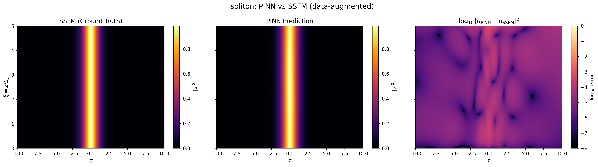

# PINN-NLSE: Physics-Informed Neural Networks for Nonlinear Fiber Optics

> Solving the Nonlinear Schrödinger Equation with physics-encoded neural
> networks, benchmarked honestly against the split-step Fourier method.

**Status**: Complete. The published weights, logs, and figures are frozen for
reproducible verification.

---

## Overview

This project applies a **Physics-Informed Neural Network (PINN)** to the
**Nonlinear Schrödinger Equation (NLSE)** — the master equation governing
optical pulse propagation in single-mode fibers — and benchmarks it against a
validated **split-step Fourier method (SSFM)** ground-truth solver.

The PINN encodes the NLSE directly into its loss function via PyTorch
autograd. The complex field `u = a + ib` is split into two real outputs and
the residual `r_a, r_b` is minimized at random collocation points alongside
initial-condition, boundary-condition, and (optionally) supervised-data
losses.

The reported PINNs in this repo are **data-augmented PINNs**: pure
physics-only training on the soliton case fell into the trivial solution
`u → 0`, a documented attractor of the NLSE. We add 500 SSFM supervision
points (`λ_data = 1.0`) and label all artifacts as such, with held-out
disjoint validation MSE for honesty. The reproduction paths below describe how
to verify the published artifacts, and
[`report/technical_report.md`](report/technical_report.md) contains the full
technical discussion.

## Headline results

| Case | Pulse-region relative L2 (vs SSFM) | Notes |
|------|-----------------------------------|-------|
| N = 1 fundamental soliton | **1.29 %** | data-augmented PINN, 500 SSFM points, 1000 held-out validation labels |
| Gaussian dispersion-only | **9.29 %** | same, harder case (`s = -1`, `N² = 0`); passes the planned `< 10 %` bar with a small margin — should be read as "meets the CPU-friendly baseline target", not as a high-margin result |
| SSFM single-solve cost (CPU) | 0.10 s | reference baseline at 1024 × 1000 grid |
| PINN forward cost (CPU) | 1.20 s | on the same 1001 × 1024 evaluation grid |

For this 1D problem on CPU, the SSFM is faster than the PINN at fixed-case
inference. We report this honestly — the PINN's value lies in inverse
problems, parameter-conditioned extensions, and continuous evaluation, not
in beating SSFM at its own forward solve.

## The hero figure

The 3-panel side-by-side comparison is the project's main visual deliverable:
SSFM ground truth | PINN prediction | log₁₀ pointwise error.

A more detailed log-scale error map and three cross-section overlays at
ξ = 0, 2.5, 5 are saved to
[`figures/error_map_soliton.png`](figures/error_map_soliton.png) and
[`figures/cross_section_soliton.png`](figures/cross_section_soliton.png).
